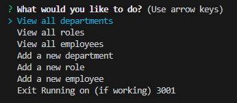

# Employee Trakcer

This application is called "Employee Tracker" that can be used to track employees on a global level. This applicaiton is built with JavaScript, Node, Express.js, MySQL. This applicaiton is deployed through Github and Heroku. 

## Getting Started

These instructions will get you a copy of the project up and running on your local machine for development and testing purposes. See deployment for notes on how to deploy the project on a live system.

1. Open the Heroku link below.
2. Once on the page click "Get Started".
3. Type a title in the "Note Title" Section.
4. Type some text in the "Note Text" section.
5. Lastly, click the save icon in the top right of the webpage.

### Installing

Download the code or visit the direct Heroku link below.

## Deployment

Please use the Heroku direct application link to access the the webpage

https://employee-tracker23445234-5f9a60d15d96.herokuapp.com/

## Built With

* [JavaScript](https://www.javascript.com/) - FrontEnd
* [Node](https://nodejs.org/en) - Backend
* [Express](https://expressjs.com/) - Backend Framework
* [MySQL](https://www.mysql.com/) - Backend

## Authors

* **Bradley Sanderson** - *Initial work* - [SandersonHub](https://github.com/SandersonHub)

## Future Development

* In the future I would like to add more categories to the exsisting framework.
## Acknowledgments

* Huge Thank you to Github user [PurpleBooth](https://gist.github.com/PurpleBooth/109311bb0361f32d87a2) for the README template.

## Feature Photos

